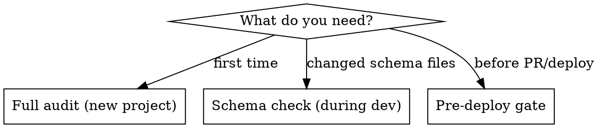

# Shopify Schema Audit

Structured audit workflow for **Shopify Liquid themes** (Dawn, Horizon, custom OS 2.0 themes, etc.). Validates JSON-LD structured data, Open Graph meta tags, product metadata, and store configuration for SEO rich results and AI search visibility.

## When to Use

- Before deploying a Shopify Liquid theme to production
- After implementing or modifying JSON-LD schema in `.liquid` files
- When onboarding a new Shopify theme project
- During periodic SEO/structured data reviews
- When `shopify theme check` passes but structured data hasn't been validated

**Scope:** Shopify Liquid themes only — the audit greps `.liquid` files, checks Liquid filters (`| json`, `| metafield_tag`, `| strip_html`), and validates Liquid objects (`shop.brand`, `cart.currency`, `variant.barcode`).

**Not for:** Headless projects (Hydrogen, Next.js, Nuxt — these don't use Liquid), Shopify app development, or product data-only audits (use FoundGPT or AgentReady apps for that).

## Audit Modes

- **Full audit**: All 4 phases. Run on first contact with a project.
- **Schema check**: Phase 2 only. Run after editing any file with `application/ld+json`.
- **Pre-deploy gate**: Phases 2 + 3. Quick validation before opening a PR.

## Phase 1: Discovery

Map every JSON-LD implementation in the theme.

1. Grep for `application/ld+json` across all `.liquid` files
2. For each file found, identify the `@type` values emitted
3. Check which templates include each file (grep for `render` or `include` of the filename)
4. Build coverage matrix using the template in [templates/report-template.md](templates/report-template.md)

## Phase 2: Schema & Meta Validation

Validates all structured signals AI agents and search crawlers use to understand the page — primarily JSON-LD, plus Open Graph tags as a parallel signal used when JSON-LD is incomplete or absent.

### JSON-LD structured data

For each block found in Phase 1, run the relevant checks:

- **Product / ProductGroup** (checks 1-9): See [references/product-schema-checks.md](references/product-schema-checks.md)
- **AggregateRating** (checks 10-13): See [references/rating-checks.md](references/rating-checks.md)
- **FAQPage** (checks 14-18): See [references/faq-checks.md](references/faq-checks.md)
- **Organization & BreadcrumbList** (checks 19-23c): See [references/organization-checks.md](references/organization-checks.md)
- **MerchantReturnPolicy** (checks 39-42): See [references/returns-checks.md](references/returns-checks.md)
- **Global checks for all blocks** (checks 24-29): See [references/global-checks.md](references/global-checks.md)
- **Conflict detection** (checks 29a-29c): Also in [references/global-checks.md](references/global-checks.md) — checks for duplicate schema from SEO apps, microdata/JSON-LD mixing, and native `structured_data` filter reliance

### Open Graph meta tags

- **Open Graph tags** (checks 43-47): See [references/open-graph-checks.md](references/open-graph-checks.md)

Only load the reference files relevant to what Phase 1 found or what the current audit is focused on.

## Phase 3: Store Readiness

Checks 30-38 verify store-level configuration that affects structured data quality and search visibility. Some checks require admin access and should be flagged as "VERIFY MANUALLY" in the report.

See [references/storefront-readiness.md](references/storefront-readiness.md)

## Phase 4: Report Generation

Generate `SCHEMA_AUDIT_REPORT.md` using the template in [templates/report-template.md](templates/report-template.md).

**Scoring guide:**
- Critical issue: -10 points from category
- Major issue: -5 points from category
- Minor issue: -2 points from category
- Minimum score per category: 0

## Troubleshooting

If you encounter edge cases with Liquid metafields, schema output, or CSS specificity issues, see [references/common-mistakes.md](references/common-mistakes.md) for documented solutions from real Shopify theme projects.
