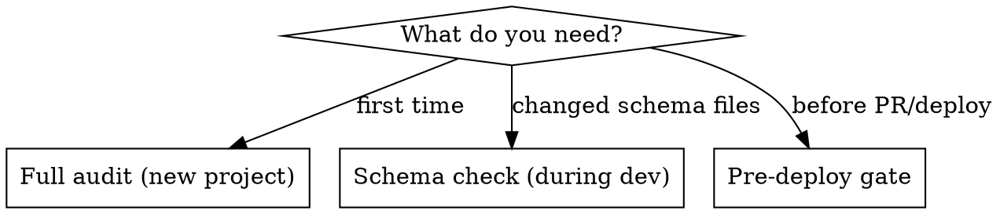

# Shopify Agentic Commerce Readiness Audit

Structured audit workflow for Shopify Liquid themes. Validates that JSON-LD structured data, product metadata, and store configuration are optimized for AI agent discovery (ChatGPT, Google AI Mode, Perplexity, Microsoft Copilot).

## When to Use

- Before deploying a Shopify theme to production
- When a client asks about agentic storefronts or AI shopping visibility
- After implementing or modifying JSON-LD schema in a theme
- When onboarding a new Shopify project at the agency
- During periodic SEO/structured data reviews
- When `shopify theme check` passes but structured data hasn't been validated

**Not for:** Shopify app development, Hydrogen/headless projects (use Storefront MCP instead), or product data-only audits (use FoundGPT or AgentReady apps for that).

## Audit Modes



- **Full audit**: All 4 phases. Run on first contact with a project.
- **Schema check**: Phase 2 only. Run after editing `rich-results.liquid` or any file with `application/ld+json`.
- **Pre-deploy gate**: Phases 2 + 3. Quick validation before opening a PR.

## Phase 1: Discovery — Find All Structured Data

**Goal:** Map every JSON-LD implementation in the theme.

**Steps:**
1. Grep for `application/ld+json` across all `.liquid` files
2. For each file found, identify the `@type` values emitted
3. Check which templates include each file (grep for `render` or `include` of the filename)
4. Build a coverage matrix

**Output: Schema Coverage Matrix**

Record which schema types exist and where:

| Schema Type | File | Template Context |
|---|---|---|
| Product / ProductGroup | ? | product template |
| AggregateRating | ? | product template |
| FAQPage | ? | product, collection, FAQ page |
| Organization | ? | homepage, author pages |
| WebSite + SearchAction | ? | homepage |
| BreadcrumbList | ? | all templates |
| CollectionPage + ItemList | ? | collection template |
| Article | ? | blog article template |
| Blog | ? | blog index template |
| Person | ? | author pages |
| Offer | ? | inside Product/ProductGroup |

Mark each as: present, missing, or partial.

## Phase 2: Schema Validation — Check Correctness

For each JSON-LD block found in Phase 1, validate against these checks.

### 2A. Product / ProductGroup Schema

| # | Check | How to verify | Severity |
|---|---|---|---|
| 1 | Uses `ProductGroup` for multi-variant products | Look for variant count conditional logic | Critical |
| 2 | `name` field is populated (not empty) | Check Liquid output expression | Critical |
| 3 | `brand` uses `@type: "Brand"` (not `"Thing"`) | Grep for `"Thing"` near brand. Google recommends `"Brand"` explicitly. | Major |
| 4 | `image` field uses product or variant image | Check for `featured_image` or `variant.image` | Major |
| 5 | Each variant in `hasVariant` has `sku`, `price`, `availability` | Read the variant loop | Critical |
| 6 | `price` is numeric, not string-wrapped | Check for `| money` vs raw price | Major |
| 7 | `availability` maps to `schema.org/InStock` etc. | Check conditional on `variant.available` | Major |
| 8 | `url` includes variant parameter (`?variant=ID`) | Check for `variant.id` in URL | Minor |
| 9 | Currency uses `cart.currency.iso_code` (not hardcoded) | Grep for currency source | Major |

### 2B. AggregateRating Schema

| # | Check | How to verify | Severity |
|---|---|---|---|
| 10 | Rating source exists (Okendo, Judge.me, Yotpo, etc.) | Grep for review app metafields | Critical |
| 11 | `ratingValue` and `reviewCount` are gated (not emitted when zero/blank) | Check conditional before schema block | Critical |
| 12 | Values are numeric (use `\| plus: 0` or `\| times: 1` to coerce) | Check for type coercion | Major |
| 13 | Review metafield uses `` before `contains` check | Metafield drops require capture to coerce to string | Major |

### 2C. FAQPage Schema

| # | Check | How to verify | Severity |
|---|---|---|---|
| 14 | `mainEntity` is an array of `Question` objects | Check JSON structure | Critical |
| 15 | Each `Question` has `acceptedAnswer` with `@type: "Answer"` | Check nested structure | Critical |
| 16 | Answer text uses `strip_html` for clean output | Grep for `strip_html` | Major |
| 17 | Richtext metafields use safe text extraction | If schema code uses `strip_html` but display code uses `metafield_tag` for the same field, flag as risk. Metafield type cannot be confirmed from Liquid alone. **Preferred approach:** use `\| metafield_text` filter (returns plain text for `rich_text_field` per Shopify docs) instead of `metafield_tag` + `capture` + `strip_html`. | Critical |
| 18 | No trailing comma in JSON array (proper `forloop.last` check) | Check comma logic in loop | Major |

### 2D. Organization Schema

| # | Check | How to verify | Severity |
|---|---|---|---|
| 19 | `logo` URL is dynamic (uses `shop.brand.logo`), not hardcoded path | Grep for hardcoded `/logo.png` or similar | Major |
| 20 | `logo` is conditionally omitted when brand assets not configured | Check for `shop.brand.logo != blank` guard | Minor |
| 21 | `sameAs` array has valid social URLs (not empty strings) | Check for blank guards. Prefer `shop.brand.metafields.social_links.<platform>.value` over section settings. | Major |

### 2E. BreadcrumbList Schema

| # | Check | How to verify | Severity |
|---|---|---|---|
| 22 | Exists on product, collection, article, and page templates | Check template conditionals | Major |
| 23 | `position` values are sequential (1, 2, 3...) | Check loop counter | Minor |

### 2F. Global Checks (all schema blocks)

| # | Check | How to verify | Severity |
|---|---|---|---|
| 24 | `@context` uses `https://schema.org` consistently (not `http://`) | Grep for `http://schema.org` | Minor |
| 25 | No hardcoded URLs (use `shop.url`, `request.origin`, Liquid objects) | Grep for hardcoded domains | Major |
| 26 | JSON-LD is rendered before `content_for_layout` (in `<head>` or top of `<body>`) | Check include placement in layout/theme.liquid | Minor |
| 27 | JSON output is valid (no unescaped quotes, proper `\| json` filter usage) | Check for `\| json` on dynamic string values | Critical |
| 28 | Date fields use `\| date` filter (not raw `created_at` output) | Check Article/Blog date fields in schema | Major |
| 29 | Variant selection dynamically updates schema (or ProductGroup covers all) | Check for JS-driven schema updates or ProductGroup pattern | Minor |

## Phase 3: Agentic Storefront Readiness

These checks go beyond schema markup — they verify store-level configuration for AI agent discovery.

### 3A. Verifiable from code

| # | Check | How to verify | Severity |
|---|---|---|---|
| 30 | Store policies template exists (`policy.liquid` or `shop.policies` usage) | Grep for `shop.policies` or check `templates/policy*` | Critical |
| 31 | GTIN/UPC emitted in Product/variant schema | Grep for `variant.barcode` or `gtin` in JSON-LD blocks | Major |
| 32 | Standard Product Taxonomy categories in schema output | Check if `product.category` or taxonomy metafields appear in schema | Major |
| 33 | `llms.txt` file exists in theme assets | Check for `llms.txt` in assets/ directory | Nice-to-have |

### 3B. Requires admin/store access (flag as "VERIFY MANUALLY")

These cannot be confirmed from theme code alone. Flag them in the report as manual verification items.

| # | Check | How to verify | Severity |
|---|---|---|---|
| 34 | Guest checkout is enabled | Admin > Settings > Customer accounts — must be "optional" or "disabled" | Critical |
| 35 | Product descriptions are 200+ words with specs | Sample 3-5 products in admin or via Storefront MCP `search_shop_catalog` | Major |
| 36 | Product titles follow Brand + Type + Differentiator (60-80 chars) | Sample 3-5 product titles in admin or via Storefront MCP | Major |
| 37 | Alt text on product images is descriptive (not generic or empty) | Sample images in admin or via product JSON | Minor |
| 38 | Products have GTIN/barcode data populated in admin | Check via admin or `products.json` endpoint | Major |

## Phase 4: Report Generation

Generate `AGENTIC_READINESS_REPORT.md` with this structure:

```markdown
# Agentic Readiness Report
**Project:** [theme name]
**Date:** [date]
**Auditor:** [agent or person]
**Mode:** Full / Schema Check / Pre-deploy Gate

## Score: [X]/100

### Breakdown
| Category | Score | Issues |
|---|---|---|
| Product Schema | /30 | [count] |
| Rating & Reviews | /15 | [count] |
| FAQ Schema | /15 | [count] |
| Organization & Site | /10 | [count] |
| Breadcrumbs & Navigation | /10 | [count] |
| Agentic Storefront Config | /20 | [count] |

### Critical Issues (fix before deploy)
1. [issue + file:line + fix suggestion]

### Major Issues (fix soon)
1. [issue + file:line + fix suggestion]

### Minor Issues (nice to have)
1. [issue + file:line + fix suggestion]

### Schema Coverage Matrix
[from Phase 1]

### What's Working Well
[list of correctly implemented schemas]
```

**Scoring guide:**
- Critical issue found: -10 points from category
- Major issue found: -5 points from category
- Minor issue found: -2 points from category
- Minimum score per category: 0

## Common Mistakes (from real projects)

### Okendo/review app metafield `contains` returns false
**Symptom:** `product.metafields.okendo.StarRatingSnippet contains '"averageRating"'` returns `false` even when the HTML has the string.
**Cause:** Metafield drops are objects, not strings. `contains` doesn't coerce.
**Fix:** Use `` first to render as string, then `contains`/`split`.

### Richtext metaobject outputs raw JSON in schema
**Symptom:** `acceptedAnswer.text` shows `{"type":"root","children":[...]}` instead of clean text.
**Cause:** `strip_html` on a richtext metaobject field doesn't work — the value is a structured object.
**Fix (best):** Use `{{ field | metafield_text }}` — Shopify's `metafield_text` filter returns plain text for `rich_text_field` types (per [Shopify docs](https://shopify.dev/docs/api/liquid/filters/metafield_text)).
**Fix (alternative):** `{{ field | metafield_tag }}{{ html | strip_html }}`.

### Hardcoded logo URL returns 404
**Symptom:** Organization schema `logo.url` points to `/logo.png` but returns 404.
**Cause:** Theme uses inline SVG logo, no file at that path.
**Fix:** Use `shop.brand.logo | image_url: width: 300 | prepend: 'https:'` with a blank check.

### Organization sameAs uses section settings instead of brand metafields
**Symptom:** `sameAs` array contains empty strings or breaks when section settings change.
**Cause:** Social URLs pulled from section/theme settings instead of Shopify's native brand data.
**Fix:** Use `shop.brand.metafields.social_links.<platform>.value` (supports: facebook, pinterest, instagram, tiktok, tumblr, snapchat, vimeo). Always wrap in `` guard before adding to the array.

### String comparison on numeric review values
**Symptom:** `aggregateRating` emits with `ratingValue: "0"` when no reviews exist.
**Cause:** Comparing metafield value (string) to number `0` — Liquid doesn't auto-coerce.
**Fix:** Normalize with `| plus: 0` before comparison: `assign rating_num = oke_rating | plus: 0`.

### Wrong metafield key assumed
**Symptom:** Metafield renders blank even though data exists in admin.
**Cause:** Key mismatch (e.g., `custom.lrv` vs `custom.light_reflectance_value`).
**Fix:** Always verify key by checking the admin metafield definition URL or grepping the reference project. Category metafields with hyphens need bracket notation: `product.metafields.shopify['intended-application']`.

### CSS specificity collision on injected schema-related content
**Symptom:** Metafield-driven content (e.g., PDP description) renders with wrong styles.
**Cause:** Content injected inside `metafield-rich_text_field` wrapper inherits its styles.
**Fix:** Use tag-qualified selectors (`p.your-class`) to match or beat the existing specificity.
