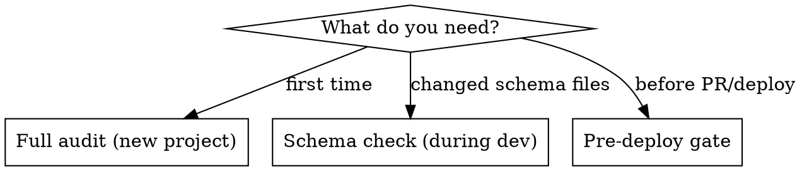

# Shopify Agentic Commerce Readiness Audit

Structured audit workflow for Shopify Liquid themes. Validates JSON-LD structured data, product metadata, and store configuration for AI agent discovery (ChatGPT, Google AI Mode, Perplexity, Microsoft Copilot).

## When to Use

- Before deploying a Shopify theme to production
- After implementing or modifying JSON-LD schema in a theme
- When onboarding a new Shopify project
- During periodic SEO/structured data reviews
- When `shopify theme check` passes but structured data hasn't been validated

**Not for:** Hydrogen/headless projects (use Storefront MCP), or product data-only audits (use FoundGPT or AgentReady apps).

## Audit Modes

- **Full audit**: All 4 phases. Run on first contact with a project.
- **Schema check**: Phase 2 only. Run after editing any file with `application/ld+json`.
- **Pre-deploy gate**: Phases 2 + 3. Quick validation before opening a PR.

## Phase 1: Discovery

Map every JSON-LD implementation in the theme.

1. Grep for `application/ld+json` across all `.liquid` files
2. For each file found, identify the `@type` values emitted
3. Check which templates include each file (grep for `render` or `include` of the filename)
4. Build coverage matrix using the template in [templates/report-template.md](templates/report-template.md)

## Phase 2: Schema Validation

For each JSON-LD block found in Phase 1, run the relevant checks:

- **Product / ProductGroup** (checks 1-9): See [references/product-schema-checks.md](references/product-schema-checks.md)
- **AggregateRating** (checks 10-13): See [references/rating-checks.md](references/rating-checks.md)
- **FAQPage** (checks 14-18): See [references/faq-checks.md](references/faq-checks.md)
- **Organization & BreadcrumbList** (checks 19-23): See [references/organization-checks.md](references/organization-checks.md)
- **Global checks for all blocks** (checks 24-29): See [references/global-checks.md](references/global-checks.md)

Only load the reference files relevant to schemas found in Phase 1.

## Phase 3: Agentic Storefront Readiness

Checks 30-38 verify store-level configuration for AI agent discovery. Some checks require admin access and should be flagged as "VERIFY MANUALLY" in the report.

See [references/storefront-readiness.md](references/storefront-readiness.md)

## Phase 4: Report Generation

Generate `AGENTIC_READINESS_REPORT.md` using the template in [templates/report-template.md](templates/report-template.md).

**Scoring guide:**
- Critical issue: -10 points from category
- Major issue: -5 points from category
- Minor issue: -2 points from category
- Minimum score per category: 0

## Troubleshooting

If you encounter edge cases with Liquid metafields, schema output, or CSS specificity issues, see [references/common-mistakes.md](references/common-mistakes.md) for documented solutions from real Shopify theme projects.
